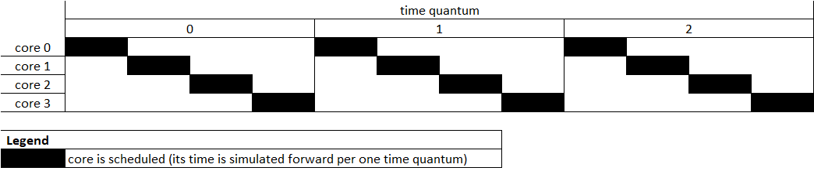
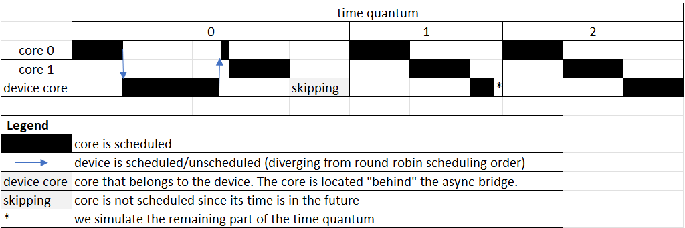
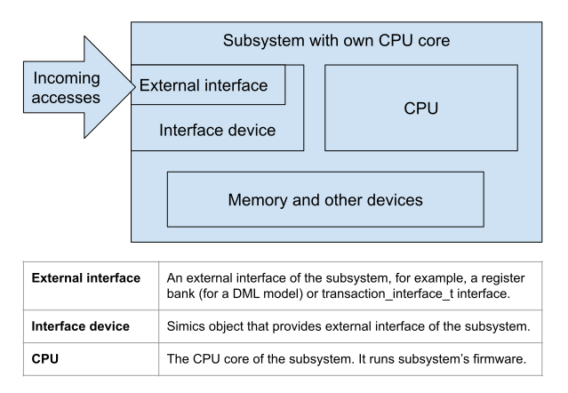
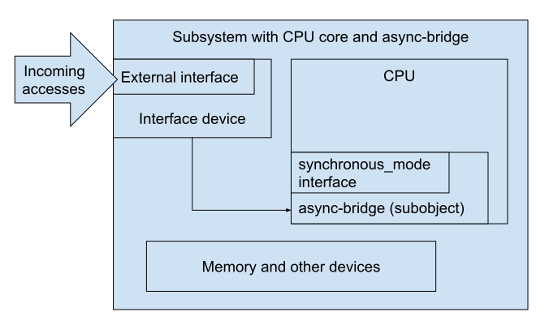
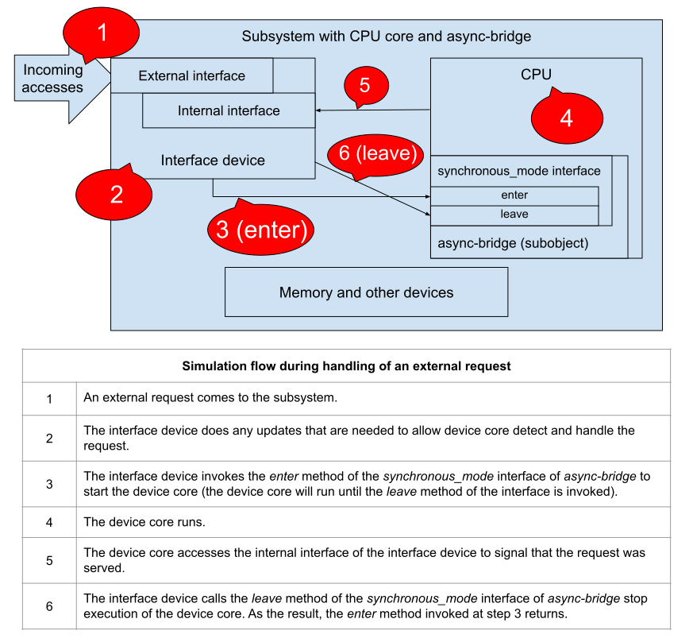

# Using `Async-Bridge` Class in Device Models to Steer a CPU Model

*The document is mainly intended for model developers who model devices that
incorporate a CPU core.*

Simics provides `async-bridge` class in order to address the limitations of how
Simics does scheduling (by default, Simics uses round-robin scheduling).
Particularly, `async-bridge` allows to schedule a modeled CPU core at any point
in virtual time in order to complete a computation task before any other CPU
model is scheduled.

Below we explain:
- how default round-robin scheduling works in Simics;
- how scheduling works when `async-bridge` is present;
- how to use `async-bridge` for simulation.

## Round-robin scheduling

By default, Simics schedules simulated processors in a round-robin fashion.
This means that Simics scheduler consecutively schedules CPUs one after
the other to simulate a given amount of virtual time (this interval
is usually called time quantum; it can be set with the `set-time-quantum`
command). When all processors in the system
have executed the interval - at this point all simulated CPUs
have the same virtual time - the whole process is repeated:

|  |
|:--:|
| *Round-robin scheduling of 4 cores in Simics* |

Our experience shows that such round-robin scheduling works rather well for
the simulation of a computer system. Things become more complicated when
we simulate a device that has its own CPU, and such device is accessed.
If the device model doesn't need to run any firmware on its CPU in order
to handle the access, then no special handling is needed. The situation differs
when the accessed device model needs to run firmware model to handle the access.
We see two alternatives here:

1. The device "registers" an access (e.g., a write operation) and the processor
   that initiated the request can proceed with execution. When the device's CPU
   will be scheduled by the round-robin Simics scheduler the device's CPU will
   process the access. This case is handled well by the round-robin scheduling.

2. A processor that initiated a request (e.g., a read operation) needs to get
   response before it can finish the current instruction. The device processor,
   however, needs to run in order to provide the reply. Round-robin scheduling
   does not allow to handle this case.

The `async-bridge` class makes it possible to handle alternative 2. It allows
the device model to schedule the device's CPU right away: the device CPU
will start execution while the device handles the request. Once the request
is handled by the device's CPU the response is returned
to the initiator of the request:

|  |
|:--:|
| *Scheduling of 2 cores and a device core that is "behind" async-bridge* |

Please note that the device's CPU still participates in round-robin
scheduling: if the device's CPU has not already executed the time
quantum it will be scheduled. If the time quantum was already executed
by the device's CPU when it was scheduled by the device to service an
incoming request, then the device's CPU is not scheduled until its
virtual time matches virtual time of other CPUs in the system. By
setting the `do_not_schedule` attribute of the `async-bridge` object
to `TRUE` one can exclude the device core from round-robin scheduling
completely: the device's CPU will be scheduled only when the device
schedules it.

## Modeling a subsystem with own CPU core

A subsystem that can be modeled with the help of `async-bridge`
may look like this:



The subsystem has an external interface (for example, a memory-mapped register
bank). The external interface is implemented by "interface device".
The subsystem also includes an execution core "CPU", memory,
and other devices.

We will use `async-bridge` to allow the interface device to schedule the device
CPU when it is need. In order to do that one should add the `async-bridge`
Simics object as a subobject of the CPU object, i.e. if the device core has
name `"subsystem.cpu"` then the name of the `async-bridge` object is going
to be `"subsystem.cpu.*name*` where `*name*` is an arbitrary name,
for example, `"async_bridge"`:



As one can see in the picture, the `async-bridge` object implements
the `synchronous_mode` interface:
```
typedef struct synchronous_mode_interface {
    int (*enter)(conf_object_t *NOTNULL obj);
    int (*leave)(conf_object_t *NOTNULL obj);
} synchronous_mode_interface_t;
```
The interface has two methods: `enter` and `leave`. Calling the `enter` method
from the `synchronous_mode` interface of the `async-bridge` object immediately
starts the execution of the device core. The method does not return until the
execution of the device core is stopped by the call to the `leave` method of
the interface. It is a responsibility of a model developer to ensure that the
`leave` method is called after the incoming request is handled. Otherwise,
the device core will continue its execution and won't allow other cores in
the system to be scheduled. One way to handle this is to use events: before
invoking the `enter` method of the `synchronous_mode` interface
the interface device can post an event on the CPU. The event handler is to call
the `leave` method in case if it has not been invoked yet.

To give an example of the `leave` method invocation, let us consider a sample
subsystem where the `leave` method is invoked by the interface device itself.
Please note that we simplified the example and do not describe the usage of the
events: the event described above can signal a timeout if the `leave` method was
not invoked already by the time when event handler is invoked. In our example,
in addition to the external interface the interface device implements an
internal interface (e.g., an internal register bank). The internal interface is
to be accessed by the device core to signal that the external request has been
handled. Once an internal register bank is accessed the interface device invokes
the `leave` method. The following picture visualizes handling of the incoming
request by this subsystem:



To sum up, here are items involved in the usage of `async-bridge`:
- creation of the `async-bridge` object
- implementation of external interfaces that will use the `enter` method of
  the `synchronous_mode` interface of `async-bridge` to run device core to serve
  incoming requests
- calling the `leave` method of the `synchronous_mode` interface to stop the
  execution of the device core.

## Miscellaneous notes about `async-bridge`

### `Async-bridge` and inspection of the interface device

With Simics one can inspect device models via Simics command line interface or
via dedicated GUIs. The interface device that was described above can be
inspected in the same way as any other device. There is no any difference here.
One thing that is quite different is that the inspection of the interface device
via its external interface will make the device core run (when the `enter`
method of the `synchronous_mode` interface is called). Simics will ignore any
breakpoints that are triggered when the device core runs because it is
being inspected.
